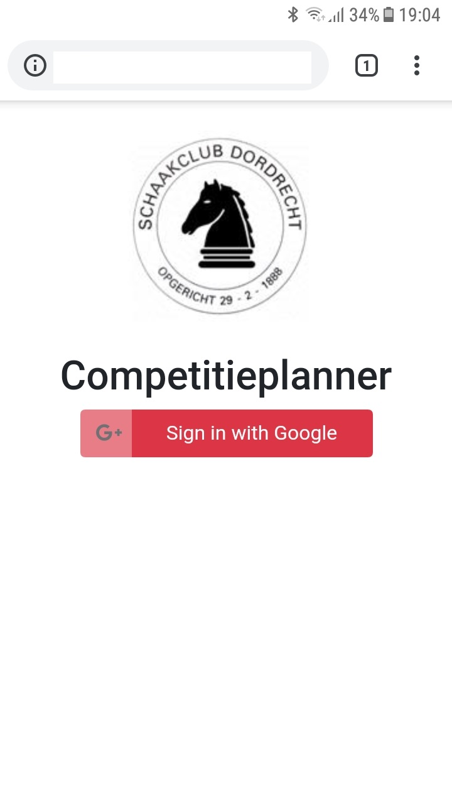
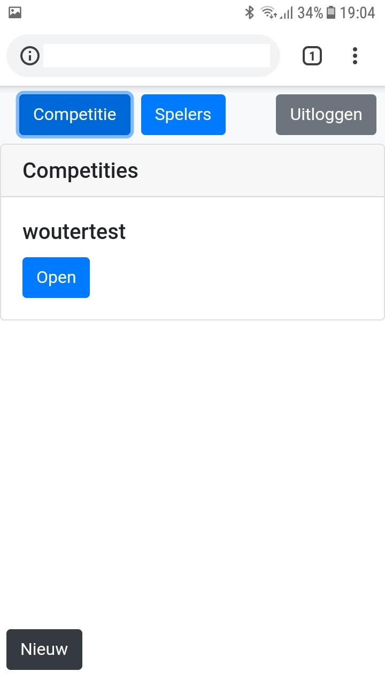
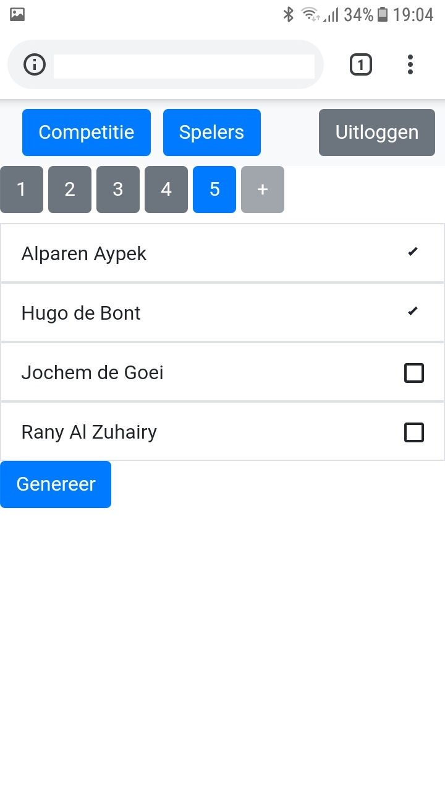
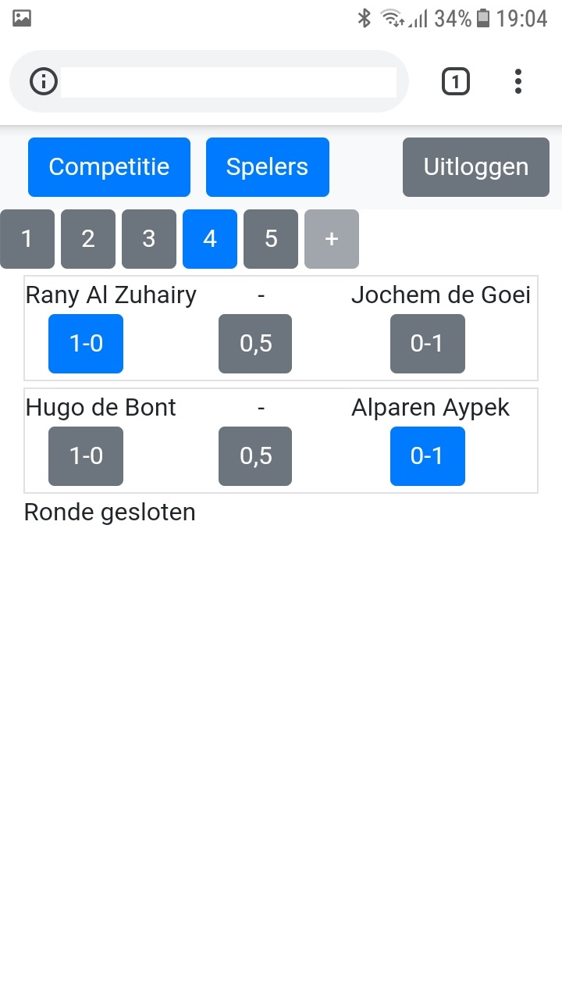
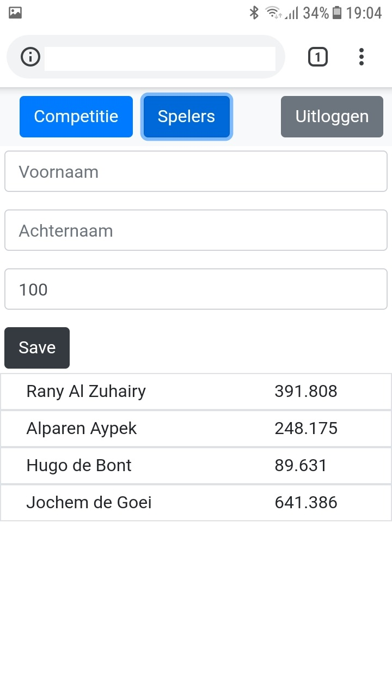

# ChessCompetitionPlanner
This application was built for Schaakclub Dordrecht, to manage the youth competition.
The idea is that on club evenings we do a check-in of players, after which the round schedule is generated. Results are immediately processed.
All works on a mobile phone.
It uses Angular 7 and ngrx/store. 
The app is using firebase as a backend.

See the screens for a feel of the application flow. 
If you want to use this code or want some assistance to set it up, contact me since I'm interested to know and help.

## Environment setup
Copy environment.ts.dummy to environment.ts. 
Go to google firebase console. Make a realtime database and add connection info in environment.ts.
Now run app. After logging in with your google account, go to your console panel in firebase to set admin permissions for your user.

## Development server (frontend)
Run `ng serve` for a dev server. Navigate to `http://localhost:4200/`. The app will automatically reload if you change any of the source files.

## Screenshots from an android phone

